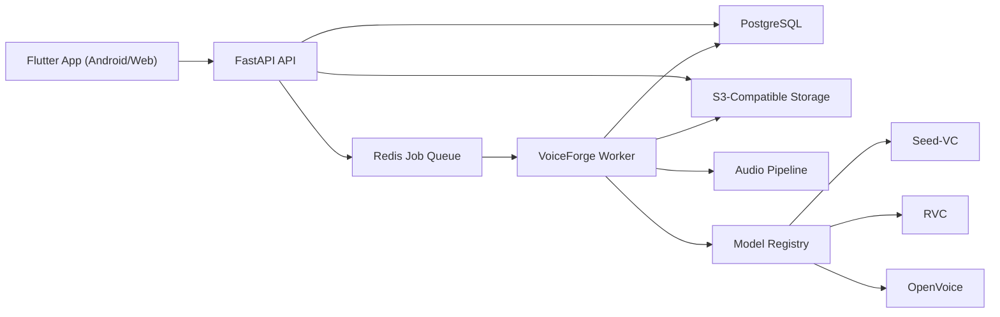

# VoiceForge Architecture

## Goals

- Support Android and Web from a single Flutter codebase.
- Keep the backend modular, production-ready, and easy to evolve toward streaming.
- Make audio backends replaceable without rewriting the platform.
- Preserve auditability, consent tracking, and future traceability/watermarking hooks.

## High-level system

## Monorepo boundaries

### `apps/voiceforge_flutter`

- Presentation shell for authentication, dashboard, saved voices, voice detail, uploads, recording, conversion creation, history, and result playback.
- Uses responsive navigation so the same product structure works on web and Android.
- UI mirrors backend concepts such as readiness score, backend selection, studio mode, and live mode.

### `services/api`

- FastAPI application.
- Hosts REST routes and OpenAPI docs.
- Owns HTTP concerns:
  - JWT authentication
  - request validation
  - file size and format validation
  - rate limiting
  - response serialization

### `services/worker`

- Long-running job processor backed by Redis.
- Executes training and conversion jobs.
- Updates persistent job state and audit logs.

### `packages/voiceforge_core`

- Shared domain package for API and worker.
- Contains:
  - SQLAlchemy models
  - enums
  - module services
  - storage adapters
  - audio pipeline contracts
  - model registry
  - training orchestrator contract
  - Redis queue primitive

## Domain modules

- `auth`
- `users`
- `voice_profiles`
- `voice_samples`
- `speaker_embeddings`
- `training_jobs`
- `conversion_jobs`
- `storage`
- `audit`

## Data model

### `users`

- Platform account and ownership boundary.

### `voice_profiles`

- A saved target voice owned by a user.
- Stores consent details, preferred backend, dataset quality metrics, and readiness score.

### `voice_samples`

- Individual uploaded or recorded sample.
- Stores storage key, content metadata, VAD/segmentation metadata, and quality signals.

### `speaker_embeddings`

- Embedding artifacts extracted per sample or profile.
- Persisted independently so embedding strategy can evolve without changing the rest of the schema.

### `training_jobs`

- Asynchronous training or profile preparation task.
- Current starter implementation emits a manifest artifact instead of launching GPU training.

### `conversion_jobs`

- Asynchronous conversion request.
- Stores source input metadata, selected backend, mode, and readiness snapshot.

### `converted_audios`

- One or more output artifacts per conversion job.
- Includes traceability metadata and future watermark state.

### `audit_logs`

- Immutable activity trail for registration, profile creation, sample uploads, training, and conversion.

## Audio pipeline design

The current package already separates the audio pipeline into swappable contracts:

- `AudioPreprocessor`
- `SpeakerEmbeddingService`
- `VoiceConversionEngine`
- `ModelRegistry`
- `TrainingOrchestrator`

### Current starter behavior

- Ingestion persists audio to bucket-style local storage.
- Metadata probing extracts duration, sample rate, and channel information.
- Real offline preprocessing now converts to mono WAV, resamples, normalizes, trims silence, and derives lightweight VAD-like segments.
- Deterministic placeholder embeddings are persisted to storage and linked through `speaker_embeddings`.
- Seed-VC is now a real offline conversion backend invoked through the official upstream CLI in an isolated runtime.
- RVC and OpenVoice remain placeholder backends for now.

### Intended next evolution

- Expand the current real preprocessing with richer denoising, segmentation, and streaming-aware chunking.
- Replace hash embeddings with ECAPA-TDNN, WavLM, or another speaker encoder.
- Replace the remaining placeholder engines with actual RVC and OpenVoice integrations.
- Add streaming transport and chunked inference paths for live mode.

## Readiness score

`voice profile readiness score` is computed from:

- total duration
- clip count
- noise score
- diversity score
- sample rate

The score intentionally lives at the domain layer so both the API and the UI can reason about training fitness consistently.

## Security model

- Consent is mandatory to create a voice profile.
- JWT auth is in place for API access.
- Audit logs record creation, training, and conversion activity.
- File extensions and payload size are validated at the API boundary.
- Rate limiting middleware is present and can be replaced by a Redis/distributed implementation later.
- Converted outputs already reserve a traceability payload and watermark status field for future provenance enforcement.

## Studio mode vs live mode

### Studio mode

- Queue-first workflow.
- Highest-quality offline conversion path.
- This is now the active path for real Seed-VC execution and artifact storage.

### Live mode

- Current starter keeps mode selection in schema, REST, jobs, and UI.
- This preserves a clean migration path toward:
  - WebSocket transport
  - chunked buffering
  - low-latency inference workers
  - streaming output delivery

## Operational notes

- Docker Compose is prepared for `api`, `worker`, `postgres`, and `redis`.
- The current environment used to scaffold the repository did not have Docker installed, so container assets were authored but not executed here.
- The API and worker share the same `voiceforge_core` package to reduce drift between HTTP behavior and async processing behavior.
